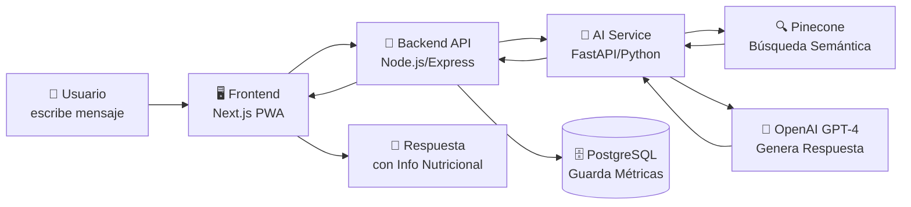
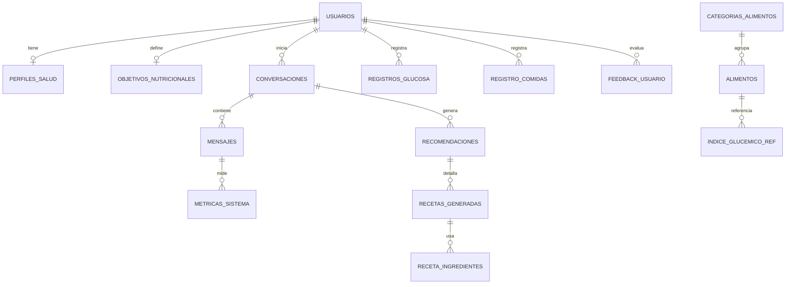

<p align="center">
  
  
  
  
  
</p>

# 🍎 NutriDiabetes Perú

**Sistema Inteligente de Recomendaciones Nutricionales para pacientes con Diabetes Mellitus Tipo 2 (DM2)**, basado en la Tabla Peruana de Composición de Alimentos 2025 (TPCA — CENAN/INS) y arquitectura **RAG** (Retrieval-Augmented Generation).

> 📚 **Proyecto de Tesis** — Maestría en Ingeniería de Sistemas e Informática  
> 🏫 Universidad Continental, Huancayo — Perú  
> 👨‍💻 Autor: Jersson Corilla

---

## 📋 Tabla de Contenidos.

- [Objetivo](#-objetivo)
- [¿Cómo Funciona?](#-cómo-funciona)
- [Arquitectura del Sistema](#-arquitectura-del-sistema)
- [Stack Tecnológico](#-stack-tecnológico)
- [Estructura del Proyecto](#-estructura-del-proyecto)
- [Requisitos Previos](#-requisitos-previos)
- [Instalación y Configuración](#-instalación-y-configuración)
- [Variables de Entorno](#-variables-de-entorno)
- [Ejecución](#-ejecución)
- [API Endpoints](#-api-endpoints)
- [Base de Datos](#-base-de-datos)
- [Pipeline RAG](#-pipeline-rag)
- [Módulos del Frontend](#-módulos-del-frontend)
- [Estado Actual del Proyecto](#-estado-actual-del-proyecto)
- [Mejoras Futuras](#-mejoras-futuras-roadmap)
- [Métricas de Evaluación (Tesis)](#-métricas-de-evaluación-tesis)
- [Contribución](#-contribución)
- [Licencia](#-licencia)

---

## 🎯 Objetivo

Brindar **recomendaciones nutricionales personalizadas** a pacientes con Diabetes Mellitus Tipo 2 en Perú, generando:

- 🍽️ **Recetas completas** adaptadas a DM2 con información nutricional detallada
- 🧠 **Explicaciones científicas** (IA Explicable — XAI) de por qué cada alimento es beneficioso
- 🥦 **Secuenciación alimentaria** (Food Sequencing) para reducir picos glucémicos
- 💰 **Clasificación de accesibilidad económica** de cada receta
- 🔄 **Alternativas** para ingredientes no disponibles

Todo basado en los **888 alimentos** de la Tabla Peruana de Composición de Alimentos del CENAN/INS (Ministerio de Salud del Perú).

---

## 🧠 ¿Cómo Funciona?



### Flujo detallado:

1. **El usuario ingresa qué tiene en su cocina** → _"Tengo pollo, quinua y brócoli"_
2. **El Backend** recibe el mensaje, obtiene el perfil de salud del paciente y lo envía al microservicio IA
3. **El AI Service** genera un embedding del mensaje con OpenAI (`text-embedding-3-small`)
4. **Pinecone** busca semánticamente los alimentos más relevantes de la TPCA
5. **GPT-4** recibe el contexto nutricional + perfil del paciente y genera una recomendación personalizada
6. **Se guardan** las métricas RAG (similitud coseno, tokens, tiempo) en PostgreSQL para evaluación de tesis
7. **El frontend** muestra la recomendación con formato enriquecido (receta, info nutricional, tips DM2)

---

## 🏗️ Arquitectura del Sistema

```
┌─────────────────────────────────────────────────────────────────┐
│                        CLIENTE (PWA)                           │
│  ┌─────────────────────────────────────────────────────────┐   │
│  │  Next.js 14 + TailwindCSS + Google Fonts (Inter/Outfit) │   │
│  │  Axios · Recharts · Lucide React · next-pwa             │   │
│  │  Google OAuth (@react-oauth/google)                      │   │
│  └────────────────────────┬────────────────────────────────┘   │
│                           │ HTTP/REST (JWT)                     │
└───────────────────────────┼─────────────────────────────────────┘
                            │
┌───────────────────────────┼─────────────────────────────────────┐
│                    BACKEND API (REST)                           │
│  ┌────────────────────────┴────────────────────────────────┐   │
│  │  Node.js 18 + Express 4.21                              │   │
│  │  Helmet · CORS · Rate Limit · Morgan · JWT · bcryptjs   │   │
│  │  Controladores: Auth, Chat, Alimentos, Glucosa,         │   │
│  │                 Perfil, Dashboard                        │   │
│  └─────┬──────────────────────────────────────────┬────────┘   │
│         │ SQL (pg)                                 │ HTTP       │
└─────────┼──────────────────────────────────────────┼────────────┘
          │                                          │
┌─────────┴─────────┐                  ┌─────────────┴────────────┐
│   PostgreSQL 16   │                  │   AI SERVICE (RAG)       │
│   ┌─────────────┐ │                  │  ┌────────────────────┐  │
│   │ 17+ tablas  │ │                  │  │ FastAPI + Uvicorn   │  │
│   │ 9 types     │ │                  │  │ OpenAI SDK          │  │
│   │ 7 triggers  │ │                  │  │ Pinecone SDK        │  │
│   │ 3 vistas    │ │                  │  │ Pydantic v2         │  │
│   └─────────────┘ │                  │  └──────┬──────┬──────┘  │
└───────────────────┘                  │         │      │         │
                                       └─────────┼──────┼─────────┘
                                                 │      │
                                       ┌─────────┴┐  ┌──┴──────────┐
                                       │ Pinecone │  │ OpenAI API  │
                                       │ Vector DB│  │ GPT-4       │
                                       │ 1536 dim │  │ Embeddings  │
                                       └──────────┘  └─────────────┘
```

---

## 🔷 Stack Tecnológico

### Frontend

| Tecnología              | Versión | Propósito                               |
| ----------------------- | ------- | --------------------------------------- |
| **Next.js**             | 14.2.0  | Framework React con SSR y App Router    |
| **React**               | 18.3.1  | Biblioteca UI                           |
| **TailwindCSS**         | 3.4.0   | Utilidades CSS con diseño MINSA/EsSalud |
| **Axios**               | 1.7.7   | Cliente HTTP con interceptores JWT      |
| **Recharts**            | 2.12.0  | Gráficas de seguimiento de glucosa      |
| **Lucide React**        | 0.441.0 | Iconos SVG médicos                      |
| **next-pwa**            | 5.6.0   | Progressive Web App (instalable)        |
| **@react-oauth/google** | 0.13.5  | Autenticación Google OAuth 2.0          |
| **Google Fonts**        | —       | Inter + Outfit (tipografía moderna)     |

### Backend API

| Tecnología             | Versión | Propósito                                   |
| ---------------------- | ------- | ------------------------------------------- |
| **Node.js**            | 18+     | Runtime del servidor                        |
| **Express**            | 4.21.0  | Framework HTTP REST                         |
| **PostgreSQL (pg)**    | 8.13.0  | Driver de base de datos                     |
| **jsonwebtoken**       | 9.0.2   | Autenticación JWT (access + refresh tokens) |
| **bcryptjs**           | 2.4.3   | Hash de contraseñas                         |
| **Helmet**             | 7.1.0   | Seguridad de headers HTTP                   |
| **cors**               | 2.8.5   | Control de acceso cruzado                   |
| **express-rate-limit** | 7.4.0   | Protección contra abuso                     |
| **Morgan**             | 1.10.0  | Logger de peticiones HTTP                   |
| **Axios**              | 1.7.7   | Comunicación con microservicio RAG          |
| **Nodemon**            | 3.1.4   | Hot-reload en desarrollo                    |

### Microservicio IA (RAG)

| Tecnología     | Versión | Propósito                                     |
| -------------- | ------- | --------------------------------------------- |
| **Python**     | 3.13    | Lenguaje del microservicio                    |
| **FastAPI**    | 0.115.0 | Framework API asíncrono de alto rendimiento   |
| **Uvicorn**    | 0.30.0  | Servidor ASGI                                 |
| **OpenAI SDK** | 1.50.0  | Embeddings (`text-embedding-3-small`) + GPT-4 |
| **Pinecone**   | latest  | Cliente SDK para base de datos vectorial      |
| **Pydantic**   | 2.9.0   | Validación de datos y esquemas                |
| **httpx**      | 0.27.0  | Cliente HTTP asíncrono                        |
| **NumPy**      | 1.26.4  | Operaciones numéricas                         |

### Base de Datos & Servicios Externos

| Servicio          | Propósito                                                                          |
| ----------------- | ---------------------------------------------------------------------------------- |
| **PostgreSQL 16** | Base de datos relacional principal (17+ tablas, triggers, vistas)                  |
| **Pinecone**      | Base de datos vectorial para RAG (índice: `nutri-diabetes-peru`, 1536 dimensiones) |
| **OpenAI API**    | LLM GPT-4 para generación + `text-embedding-3-small` para embeddings               |
| **Google Cloud**  | OAuth 2.0 para autenticación                                                       |

### Scripts de Ingesta de Datos

| Tecnología     | Propósito                                        |
| -------------- | ------------------------------------------------ |
| **pdfplumber** | Extracción de tablas del PDF de la TPCA 2025     |
| **pandas**     | Transformación y limpieza de datos nutricionales |
| **openpyxl**   | Exportación a Excel                              |

---

## 📁 Estructura del Proyecto

```
NutriDiabetes/
├── 📂 frontend/                     # 🖥️ Next.js 14 PWA
│   ├── src/
│   │   ├── app/
│   │   │   ├── layout.js           # Layout principal (Inter/Outfit, PWA meta)
│   │   │   ├── page.js             # Landing page
│   │   │   ├── providers.js        # Google OAuth Provider
│   │   │   ├── globals.css         # Estilos globales (7.7KB)
│   │   │   ├── login/page.js       # Página de login (Google OAuth)
│   │   │   ├── chat/page.js        # 💬 Chat RAG principal (21KB)
│   │   │   ├── dashboard/page.js   # 📊 Dashboard del paciente
│   │   │   ├── alimentos/page.js   # 🥗 Explorador de alimentos TPCA
│   │   │   ├── glucosa/page.js     # 📈 Registro de glucosa con gráficas
│   │   │   └── perfil/page.js      # 👤 Perfil de salud DM2
│   │   └── lib/
│   │       └── api.js              # Cliente Axios con interceptores JWT
│   ├── public/                      # Assets estáticos y manifest PWA
│   ├── next.config.js               # Config Next.js + PWA
│   ├── tailwind.config.js           # Paleta MINSA/EsSalud personalizada
│   └── package.json
│
├── 📂 backend/                      # 🔧 API REST Node.js
│   ├── src/
│   │   ├── server.js               # Entry point con graceful shutdown
│   │   ├── app.js                  # Express config (CORS, Helmet, Rate Limit)
│   │   ├── config/
│   │   │   └── database.js         # Pool PostgreSQL
│   │   ├── controllers/
│   │   │   ├── authController.js   # Login local + Google OAuth + JWT
│   │   │   ├── chatController.js   # Chat RAG (proxy a AI Service)
│   │   │   ├── alimentosController.js # CRUD alimentos TPCA
│   │   │   ├── glucosaController.js   # Registro de glucosa
│   │   │   ├── perfilController.js    # Perfil de salud DM2
│   │   │   └── dashboardController.js # Métricas y feedback
│   │   ├── routes/
│   │   │   ├── auth.routes.js
│   │   │   ├── chat.routes.js
│   │   │   ├── alimentos.routes.js
│   │   │   ├── glucosa.routes.js
│   │   │   ├── perfil.routes.js
│   │   │   └── dashboard.routes.js
│   │   └── middleware/
│   │       ├── auth.js             # Verificación JWT
│   │       └── errorHandler.js     # Manejo centralizado de errores
│   ├── .env.example
│   └── package.json
│
├── 📂 ai-service/                   # 🤖 Microservicio RAG (Python)
│   ├── main.py                     # FastAPI app con endpoints RAG
│   ├── app/
│   │   ├── rag_service.py          # Pipeline RAG completo (350 líneas)
│   │   │                           # System prompt clínico especializado
│   │   │                           # Búsqueda semántica en Pinecone
│   │   │                           # Generación con GPT-4
│   │   └── embeddings_service.py   # Generación y upload de embeddings
│   ├── requirements.txt
│   └── .env.example
│
├── 📂 database/                     # 🗄️ Scripts SQL
│   ├── init_database.sql           # DDL completo (875 líneas)
│   │                               # 17+ tablas, 9 tipos enum, 7 triggers
│   │                               # 3 vistas, funciones automáticas
│   ├── seed_categorias.sql         # 14 categorías con subcategorías
│   └── seed_alimentos.sql          # 888 alimentos TPCA completos (556KB)
│
├── 📂 scripts/                      # 🛠️ Utilidades de ingesta
│   ├── extraer_pdf_alimentos.py    # Extractor PDF TPCA 2016 → SQL
│   ├── extraer_tpca_2025.py        # Extractor PDF TPCA 2025 → chunks JSON
│   ├── subir_a_pinecone.py         # Sube chunks a Pinecone con embeddings
│   ├── analizar_pdfs.py            # Análisis de estructura de PDFs
│   ├── debug_pdf.py                # Debug de extracción PDF
│   └── data/
│       ├── pinecone_chunks.json    # Chunks listos para Pinecone (904KB)
│       └── tpca_2025_extraido.csv  # Datos extraídos en CSV (138KB)
│
├── .gitignore                       # Excluye .env, node_modules, __pycache__
└── README.md                        # Este archivo
```

---

## 📋 Requisitos Previos

| Requisito      | Versión Mínima | Verificar con      |
| -------------- | -------------- | ------------------ |
| **Node.js**    | 18.x           | `node --version`   |
| **npm**        | 9.x            | `npm --version`    |
| **Python**     | 3.10+          | `python --version` |
| **PostgreSQL** | 14+            | `psql --version`   |
| **Git**        | 2.x            | `git --version`    |

### Cuentas necesarias (nivel gratuito disponible):

- 🔑 [OpenAI API Key](https://platform.openai.com/api-keys) — Para embeddings y GPT-4
- 🌲 [Pinecone API Key](https://www.pinecone.io/) — Base de datos vectorial (free tier: 1 índice)
- 🔐 [Google Cloud Console](https://console.cloud.google.com/) — OAuth 2.0 Client ID

---

## ⚡ Instalación y Configuración

### 1️⃣ Clonar el repositorio

```bash
git clone https://github.com/jersson14/NutriDiabetes.git
cd NutriDiabetes
```

### 2️⃣ Base de Datos PostgreSQL

```bash
# Crear la base de datos
psql -U postgres -c "CREATE DATABASE nutridiabetes;"

# Ejecutar scripts de inicialización
psql -U postgres -d nutridiabetes -f database/init_database.sql
psql -U postgres -d nutridiabetes -f database/seed_categorias.sql
psql -U postgres -d nutridiabetes -f database/seed_alimentos.sql
```

### 3️⃣ Backend (Node.js)

```bash
cd backend
cp .env.example .env          # Copiar y editar variables de entorno
npm install
npm run dev                    # Inicia en http://localhost:4000
```

### 4️⃣ AI Service (Python)

```bash
cd ai-service
cp .env.example .env          # Copiar y editar variables de entorno
python -m venv venv
# Windows:
venv\Scripts\activate
# Linux/Mac:
source venv/bin/activate
pip install -r requirements.txt
python main.py                 # Inicia en http://localhost:8000
```

### 5️⃣ Frontend (Next.js)

```bash
cd frontend
cp .env.local.example .env.local  # Configurar variables
npm install
npm run dev                        # Inicia en http://localhost:3000
```

### 6️⃣ Ingesta de Datos a Pinecone (opcional si ya se ejecutó)

```bash
cd scripts

# Instalar dependencias de extracción
pip install pdfplumber pandas openpyxl

# Extraer datos del PDF TPCA 2025
python extraer_tpca_2025.py

# Subir chunks a Pinecone
pip install openai pinecone-client python-dotenv
python subir_a_pinecone.py
```

---

## 🔐 Variables de Entorno

### Backend (`backend/.env`)

```env
# Servidor
PORT=4000
NODE_ENV=development

# PostgreSQL
DB_HOST=localhost
DB_PORT=5432
DB_NAME=nutridiabetes
DB_USER=postgres
DB_PASSWORD=tu_password_seguro
DB_SSL=false

# JWT
JWT_SECRET=tu_jwt_secret_super_seguro
JWT_EXPIRES_IN=7d
JWT_REFRESH_EXPIRES_IN=30d

# Google OAuth
GOOGLE_CLIENT_ID=tu_google_client_id.apps.googleusercontent.com
GOOGLE_CLIENT_SECRET=tu_google_client_secret

# Microservicio IA
RAG_SERVICE_URL=http://localhost:8000

# OpenAI (para el backend directo si necesario)
OPENAI_API_KEY=sk-...

# Pinecone
PINECONE_API_KEY=tu_pinecone_api_key
PINECONE_INDEX=nutri-diabetes-peru

# Frontend URL (CORS)
FRONTEND_URL=http://localhost:3000

# Rate Limiting
RATE_LIMIT_WINDOW_MS=900000
RATE_LIMIT_MAX=100
```

### AI Service (`ai-service/.env`)

```env
# OpenAI
OPENAI_API_KEY=sk-...
OPENAI_MODEL=gpt-4
OPENAI_EMBEDDING_MODEL=text-embedding-3-small

# Pinecone
PINECONE_API_KEY=tu_pinecone_api_key
PINECONE_INDEX=nutri-diabetes-peru
PINECONE_ENVIRONMENT=us-east-1

# Servidor
AI_SERVICE_PORT=8000
AI_SERVICE_HOST=0.0.0.0

# RAG Config
RAG_TOP_K=5
RAG_TEMPERATURE=0.3
RAG_MAX_TOKENS=2000
```

### Frontend (`frontend/.env.local`)

```env
NEXT_PUBLIC_API_URL=http://localhost:4000/api
NEXT_PUBLIC_GOOGLE_CLIENT_ID=tu_google_client_id.apps.googleusercontent.com
```

---

## 🚀 Ejecución

### Desarrollo (3 terminales)

```bash
# Terminal 1 — Backend
cd backend && npm run dev

# Terminal 2 — AI Service
cd ai-service && python main.py

# Terminal 3 — Frontend
cd frontend && npm run dev
```

### URLs de desarrollo

| Servicio    | URL                       | Health Check                     |
| ----------- | ------------------------- | -------------------------------- |
| Frontend    | http://localhost:3000     | —                                |
| Backend API | http://localhost:4000/api | http://localhost:4000/api/health |
| AI Service  | http://localhost:8000     | http://localhost:8000/health     |

---

## 📡 API Endpoints

### Autenticación (`/api/auth`)

| Método | Ruta             | Descripción               | Auth |
| ------ | ---------------- | ------------------------- | ---- |
| `POST` | `/auth/login`    | Login con email/password  | ❌   |
| `POST` | `/auth/register` | Registro de nuevo usuario | ❌   |
| `POST` | `/auth/google`   | Login con Google OAuth    | ❌   |
| `GET`  | `/auth/me`       | Obtener usuario actual    | ✅   |

### Chat RAG (`/api/chat`)

| Método   | Ruta                     | Descripción                       | Auth |
| -------- | ------------------------ | --------------------------------- | ---- |
| `POST`   | `/chat/message`          | Enviar mensaje al chatbot RAG     | ✅   |
| `GET`    | `/chat/conversaciones`   | Listar conversaciones             | ✅   |
| `GET`    | `/chat/conversacion/:id` | Obtener conversación con mensajes | ✅   |
| `DELETE` | `/chat/conversacion/:id` | Eliminar conversación             | ✅   |

### Alimentos (`/api/alimentos`)

| Método | Ruta                      | Descripción                     | Auth |
| ------ | ------------------------- | ------------------------------- | ---- |
| `GET`  | `/alimentos`              | Listar alimentos con filtros    | ✅   |
| `GET`  | `/alimentos/:id`          | Detalle de un alimento          | ✅   |
| `GET`  | `/alimentos/categorias`   | Listar categorías TPCA          | ✅   |
| `GET`  | `/alimentos/recomendados` | Alimentos recomendados para DM2 | ✅   |

### Glucosa (`/api/glucosa`)

| Método | Ruta                 | Descripción                   | Auth |
| ------ | -------------------- | ----------------------------- | ---- |
| `POST` | `/glucosa`           | Registrar medición de glucosa | ✅   |
| `GET`  | `/glucosa`           | Historial de mediciones       | ✅   |
| `GET`  | `/glucosa/tendencia` | Tendencia de glucosa          | ✅   |

### Perfil (`/api/perfil`)

| Método | Ruta                | Descripción                        | Auth |
| ------ | ------------------- | ---------------------------------- | ---- |
| `GET`  | `/perfil`           | Obtener perfil de salud            | ✅   |
| `PUT`  | `/perfil/salud`     | Actualizar datos de salud DM2      | ✅   |
| `PUT`  | `/perfil/objetivos` | Actualizar objetivos nutricionales | ✅   |

### Dashboard (`/api/dashboard`)

| Método | Ruta                  | Descripción                | Auth |
| ------ | --------------------- | -------------------------- | ---- |
| `GET`  | `/dashboard`          | Resumen del dashboard      | ✅   |
| `GET`  | `/dashboard/metricas` | Métricas del sistema RAG   | ✅   |
| `POST` | `/dashboard/feedback` | Enviar feedback de usuario | ✅   |

### AI Service (`http://localhost:8000`)

| Método | Ruta                       | Descripción                      |
| ------ | -------------------------- | -------------------------------- |
| `GET`  | `/`                        | Info del servicio                |
| `GET`  | `/health`                  | Health check (Pinecone + OpenAI) |
| `POST` | `/api/recommend`           | Generar recomendación RAG        |
| `POST` | `/api/embeddings/generate` | Generar y subir embeddings       |
| `POST` | `/api/search`              | Búsqueda semántica en Pinecone   |

---

## 🗄️ Base de Datos

### Modelo Entidad-Relación (simplificado)



### Tablas principales

| Tabla                     | Registros | Descripción                                              |
| ------------------------- | --------- | -------------------------------------------------------- |
| `usuarios`                | —         | Pacientes, nutricionistas, administradores               |
| `perfiles_salud`          | —         | Datos clínicos DM2 (HbA1c, medicamentos, complicaciones) |
| `objetivos_nutricionales` | —         | Metas calóricas y de glucosa por paciente                |
| `categorias_alimentos`    | 14        | Categorías TPCA (cereales, carnes, frutas, etc.)         |
| `alimentos`               | 888       | Datos nutricionales completos de la TPCA                 |
| `conversaciones`          | —         | Sesiones de chat con el bot RAG                          |
| `mensajes`                | —         | Mensajes con métricas RAG (tokens, similitud, chunks)    |
| `recomendaciones`         | —         | Recetas generadas por el sistema                         |
| `registros_glucosa`       | —         | Mediciones de glucosa del paciente                       |
| `metricas_sistema`        | —         | Métricas MAPE, Coseno, SUS para evaluación de tesis      |
| `feedback_usuario`        | —         | Evaluación de recomendaciones (1-5 estrellas)            |

### Tipos Enumerados

- `clasificacion_dm2`: DM2 sin/con complicaciones, controlada, no controlada, pre-diabetes
- `nivel_actividad`: Sedentario → Muy activo
- `nivel_recomendacion_alimento`: Recomendado, Moderado, Limitar, Por evaluar
- `rol_usuario`: Paciente, Nutricionista, Administrador
- `tipo_comida`: Desayuno, Media mañana, Almuerzo, Media tarde, Cena, Snack
- `tipo_medicion_glucosa`: Ayunas, Pre/Post prandial, Antes de dormir, Aleatoria
- `rol_mensaje`: User, Assistant, System

### Triggers automáticos

| Trigger                    | Función                                                           |
| -------------------------- | ----------------------------------------------------------------- |
| `trg_calcular_imc`         | Calcula IMC automáticamente al insertar/actualizar peso y talla   |
| `trg_clasificar_ig`        | Clasifica alimento como Recomendado/Moderado/Limitar según IG     |
| `trg_verificar_glucosa`    | Verifica si la glucosa está en rango según objetivos del paciente |
| `trg_incrementar_mensajes` | Incrementa contador de mensajes en la conversación                |
| `trg_*_timestamp`          | Actualiza `fecha_actualizacion` automáticamente                   |

---

## 🧠 Pipeline RAG

### System Prompt Clínico

El AI Service utiliza un **System Prompt especializado de ~160 líneas** que incluye:

- 🩺 **Reglas clínicas estrictas**: Límites de carbohidratos, IG, medicamentos
- 🥦 **Food Sequencing**: Orden de consumo (vegetales → proteína → carbohidratos)
- 💊 **Interacciones farmacológicas**: Metformina, insulina, sulfonilureas, DPP-4
- 🚨 **Seguridad**: Detección de emergencias, contraindicaciones
- 📊 **Formato de receta estandarizado**: Con info nutricional, tips DM2, alternativas
- 💰 **Clasificación económica**: 🟢 Económico / 🟡 Moderado / 🔴 Premium
- 🧠 **XAI**: Explicación científica de cada ingrediente recomendado
- 🗣️ **Tono**: Español peruano, cálido, empático, adaptado a pacientes 55-74 años

### Parámetros RAG configurables

| Parámetro                | Valor Default          | Descripción                              |
| ------------------------ | ---------------------- | ---------------------------------------- |
| `RAG_TOP_K`              | 5                      | Chunks recuperados de Pinecone           |
| `RAG_TEMPERATURE`        | 0.3                    | Temperatura del LLM (baja = más preciso) |
| `RAG_MAX_TOKENS`         | 2000                   | Tokens máximos de respuesta              |
| `OPENAI_MODEL`           | gpt-4                  | Modelo LLM                               |
| `OPENAI_EMBEDDING_MODEL` | text-embedding-3-small | Modelo de embeddings                     |

---

## 🖥️ Módulos del Frontend

| Módulo        | Ruta         | Descripción                                               |
| ------------- | ------------ | --------------------------------------------------------- |
| **Login**     | `/login`     | Autenticación con Google OAuth 2.0                        |
| **Chat RAG**  | `/chat`      | Chat principal con NutriBot (recetas, consejos DM2)       |
| **Dashboard** | `/dashboard` | Resumen del paciente, gráficas, métricas                  |
| **Alimentos** | `/alimentos` | Explorador de 888 alimentos TPCA con filtros              |
| **Glucosa**   | `/glucosa`   | Registro y gráficas de mediciones de glucosa (Recharts)   |
| **Perfil**    | `/perfil`    | Datos clínicos DM2, medicamentos, objetivos nutricionales |

### Diseño UI/UX

- 🎨 **Paleta MINSA/EsSalud**: Azul `#005BAC` + Verde `#00A859`
- 📱 **PWA Instalable**: Manifest + Service Worker
- 🔤 **Tipografía**: Inter (cuerpo) + Outfit (títulos)
- 🛡️ **Seguridad**: JWT auto-renovación, redirect en 401

---

## ✅ Estado Actual del Proyecto

### ✅ Completado

- [x] Diseño de base de datos PostgreSQL completa (17+ tablas, triggers, vistas)
- [x] Extracción de datos de la TPCA 2025 (888 alimentos)
- [x] Ingesta de datos a Pinecone (chunks con embeddings)
- [x] Backend API REST completo (6 módulos con controladores)
- [x] Microservicio RAG con FastAPI (pipeline completo)
- [x] System Prompt clínico especializado para DM2
- [x] Frontend PWA con Next.js 14 (6 páginas)
- [x] Autenticación Google OAuth 2.0 + JWT
- [x] Chat RAG funcional con OpenAI GPT-4
- [x] Registro y gráficas de glucosa
- [x] Explorador de alimentos TPCA
- [x] Perfil de salud con datos clínicos DM2
- [x] Sistema de métricas para evaluación de tesis
- [x] Paleta de diseño MINSA/EsSalud
- [x] Seguridad: Helmet, CORS, Rate Limiting, JWT

### 🔄 En Progreso

- [ ] Pruebas con pacientes reales para métricas SUS
- [ ] Validación por nutricionistas clínicos
- [ ] Pulir UI/UX responsive para móviles
- [ ] Dashboard de métricas RAG para tesis

---

## 🚀 Mejoras Futuras (Roadmap)

### 🔴 Alta Prioridad

| Mejora                   | Descripción                                                      | Impacto             |
| ------------------------ | ---------------------------------------------------------------- | ------------------- |
| **Tests automatizados**  | Unit tests (Jest/Pytest) + Integration tests                     | Calidad del código  |
| **Dockerización**        | `docker-compose.yml` para levantar todo el stack con un comando  | Facilidad de deploy |
| **CI/CD**                | GitHub Actions para tests, lint, y deploy automático             | DevOps              |
| **Mejorar .gitignore**   | Agregar `node_modules/`, `__pycache__/`, `.next/`, `*.pdf`, etc. | Seguridad/Limpieza  |
| **Validar inputs**       | Agregar express-validator o Joi en el backend                    | Seguridad           |
| **Migrar a GPT-4o-mini** | Reducir costos de API sin perder calidad                         | Costo               |

### 🟡 Media Prioridad

| Mejora                        | Descripción                                                    | Impacto        |
| ----------------------------- | -------------------------------------------------------------- | -------------- |
| **Streaming de respuestas**   | SSE/WebSocket para mostrar la respuesta del LLM en tiempo real | UX             |
| **Caché de embeddings**       | Redis para cachear consultas frecuentes                        | Performance    |
| **Notificaciones push**       | Recordatorios de medición de glucosa vía PWA push              | Adherencia     |
| **Modo offline**              | Service Worker + IndexedDB para funcionar sin internet         | Accesibilidad  |
| **Multi-idioma**              | Soporte para quechua (idioma nativo peruano)                   | Inclusión      |
| **Rate limiting por usuario** | Rate limit diferenciado por rol (paciente vs nutricionista)    | Seguridad      |
| **Logging centralizado**      | Winston o Pino con rotación de logs                            | Observabilidad |

### 🟢 Baja Prioridad (futuro)

| Mejora                          | Descripción                                         | Impacto     |
| ------------------------------- | --------------------------------------------------- | ----------- |
| **OCR de fotos**                | Fotografiar plato de comida → estimar carbohidratos | Innovación  |
| **Integración con glucómetros** | Lectura automática de glucómetros Bluetooth         | IoT         |
| **Gamificación**                | Puntos/logros por mantener glucosa en rango         | Motivación  |
| **Panel Nutricionista**         | Dashboard para que el nutricionista vea pacientes   | Multi-rol   |
| **Exportar informe PDF**        | Generar informe de seguimiento para el médico       | Clínico     |
| **API pública**                 | Documentación Swagger/OpenAPI del backend           | Integración |

---

## 📊 Métricas de Evaluación (Tesis)

| Métrica                     | Qué mide                                                    | Herramienta             |
| --------------------------- | ----------------------------------------------------------- | ----------------------- |
| **MAPE**                    | Error porcentual absoluto medio de la precisión nutricional | Cálculo automático      |
| **Similitud Coseno**        | Relevancia de los chunks recuperados por Pinecone           | Pinecone + PostgreSQL   |
| **SUS**                     | System Usability Scale (usabilidad percibida, 0-100)        | Encuestas a pacientes   |
| **Precisión / Recall / F1** | Calidad de la recuperación de información                   | Evaluación por expertos |
| **Tiempo de respuesta**     | Latencia del pipeline RAG completo (ms)                     | Medición automática     |
| **Validación por expertos** | Evaluación de nutricionistas clínicos                       | Rúbrica de evaluación   |
| **Feedback de usuario**     | Calificación de recomendaciones (1-5) por criterio          | App integrada           |

> Todas las métricas se almacenan automáticamente en la tabla `metricas_sistema` de PostgreSQL para análisis posterior.

---

## 🤝 Contribución

Este es un proyecto de tesis académica. Si deseas contribuir:

1. Fork el repositorio
2. Crea una rama para tu feature (`git checkout -b feature/mi-mejora`)
3. Commit tus cambios (`git commit -m 'Agregar mi mejora'`)
4. Push a la rama (`git push origin feature/mi-mejora`)
5. Abre un Pull Request

### Convenciones de código

- **Commits**: Mensajes descriptivos en español
- **Backend**: CommonJS (`require/module.exports`)
- **Frontend**: ES Modules (`import/export`)
- **Python**: PEP 8, docstrings en español
- **SQL**: Nombres en `snake_case`, comentarios descriptivos

---

## 📄 Licencia

Proyecto de tesis académica — **Maestría en Ingeniería de Sistemas e Informática**  
Universidad Continental, Huancayo — Perú, 2026

> ⚠️ Este software es para uso académico y de investigación. No debe utilizarse como sustituto de asesoría médica profesional. Siempre consulte con un profesional de salud calificado.

---

<p align="center">
  Hecho con ❤️ en Perú 🇵🇪
  <br>
  <strong>NutriDiabetes</strong> — Nutrición inteligente para una vida mejor con diabetes
</p>
