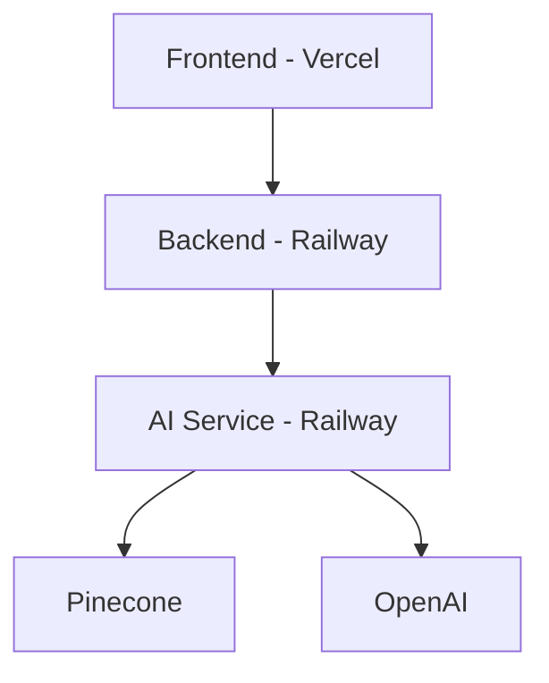
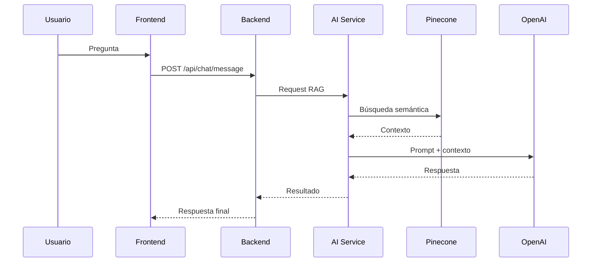
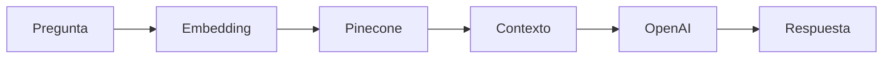
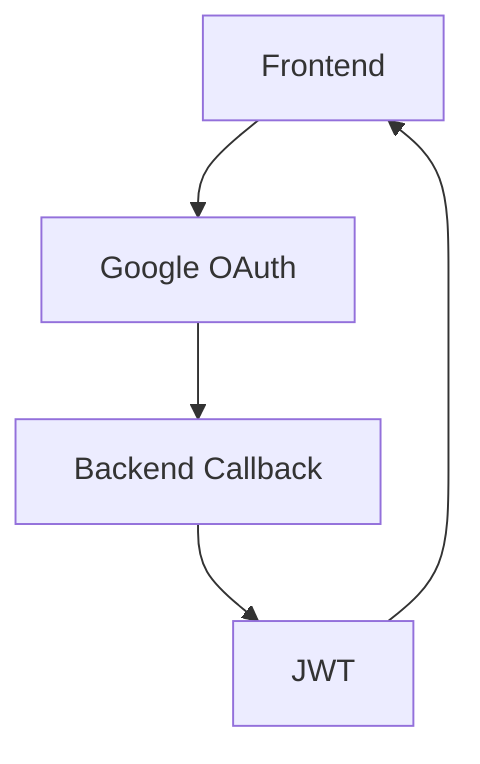
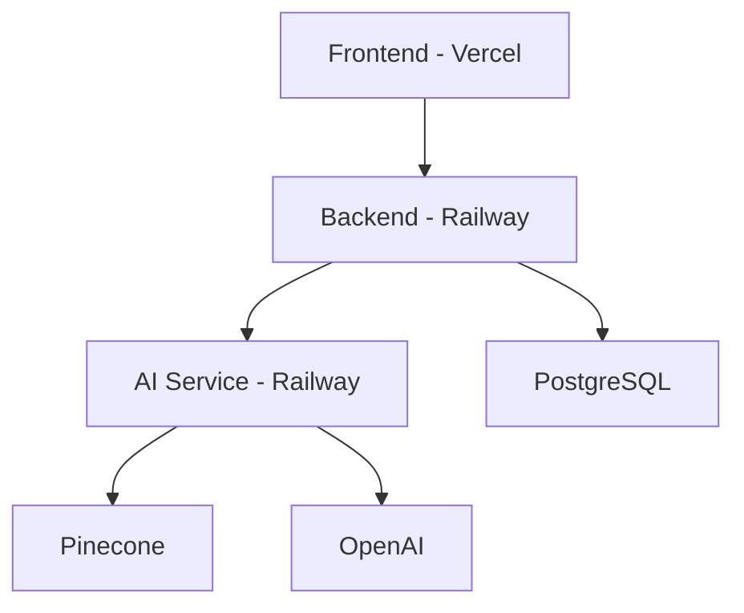

# 🩺 NutriDiabetes – Arquitectura Completa (Producción)

## 🚀 Descripción

Sistema inteligente para recomendaciones nutricionales en diabetes usando:

* Backend en Node.js (Express)
* AI Service en Python (FastAPI)
* Vector DB (Pinecone)
* LLM (OpenAI)
* Frontend (Next.js en Vercel)
* Infraestructura (Railway + Vercel)

---

# 🏗️ ARQUITECTURA GENERAL



---

# 🔁 FLUJO COMPLETO



---

# 🧱 ESTRUCTURA DEL PROYECTO

```
NutriDiabetes/
│
├── backend/                # API Node.js
│   ├── src/
│   │   ├── controllers/
│   │   ├── routes/
│   │   │   ├── chat.routes.js
│   │   │   ├── auth.routes.js
│   │   ├── middleware/
│   │   ├── config/
│   │   ├── app.js
│   │   └── server.js
│   └── package.json
│
├── ai-service/             # Servicio IA (FastAPI)
│   ├── main.py
│   ├── rag_service.py
│   └── requirements.txt
│
├── frontend/               # Next.js
│   ├── app/
│   ├── components/
│   ├── services/
│   └── package.json
│
└── README.md
```

---

# 🔌 ENDPOINTS PRINCIPALES

## Backend

```
GET  /api/health
POST /api/chat/message   (requiere token)
POST /api/auth/login
GET  /api/auth/google
```

## AI Service

```
GET  /health
POST /rag/query
```

---

# 🔐 AUTENTICACIÓN

* JWT en backend
* Middleware:

```js
router.use(authMiddleware);
```

* Header requerido:

```
Authorization: Bearer TOKEN
```

---

# 🌐 VARIABLES DE ENTORNO

## 🟣 Backend (Railway)

```
DATABASE_URL=postgresql://...
JWT_SECRET=...
OPENAI_API_KEY=...
PINECONE_API_KEY=...
RAG_SERVICE_URL=https://ai-service...
FRONTEND_URL=https://nutri-diabetes.vercel.app
GOOGLE_CLIENT_ID=...
GOOGLE_CLIENT_SECRET=...
```

---

## 🟡 AI Service (Railway)

```
OPENAI_API_KEY=...
OPENAI_MODEL=gpt-4
OPENAI_EMBEDDING_MODEL=text-embedding-3-small
PINECONE_API_KEY=...
PINECONE_INDEX=nutri-diabetes-peru
```

---

## 🟢 Frontend (Vercel)

```
NEXT_PUBLIC_API_URL=https://backend-url/api
NEXT_PUBLIC_GOOGLE_CLIENT_ID=...
```

---

# 🤖 RAG (Retrieval Augmented Generation)

Proceso:

1. Usuario pregunta
2. Se convierte a embedding
3. Se consulta Pinecone
4. Se arma contexto
5. Se envía a OpenAI
6. Se devuelve respuesta

---

# 🧠 DIAGRAMA RAG



---

# 🔑 GOOGLE LOGIN

## Flujo



## Configuración

### Authorized Origins

```
https://nutri-diabetes.vercel.app
```

### Redirect URI

```
https://backend-url/api/auth/google/callback
```

---

# 🚀 DESPLIEGUE

## Backend + AI → Railway

* Auto deploy desde GitHub
* Variables configuradas

## Frontend → Vercel

* Root: `/frontend`
* Variables definidas
* Redeploy obligatorio al cambiar env

---

# 🧪 PRUEBAS

## Health Backend

```
/api/health
```

## Health AI

```
/health
```

## Chat

```
POST /api/chat/message
```

---

# ⚠️ ERRORES COMUNES

| Error             | Causa                      |
| ----------------- | -------------------------- |
| client_id missing | falta variable en frontend |
| 401 Unauthorized  | falta token                |
| CORS              | FRONTEND_URL mal           |
| 404 route         | endpoint incorrecto        |
| fetch failed      | API URL mal                |

---

# 🔥 ARQUITECTURA FINAL



---

# 🎯 ESTADO FINAL

✔ Backend desplegado
✔ AI Service funcionando
✔ Base de datos conectada
✔ Pinecone indexado
✔ OpenAI integrado
✔ Frontend en producción
✔ Google OAuth configurado

---

# 👨‍💻 AUTOR

Sistema desarrollado por Jersson 🚀
